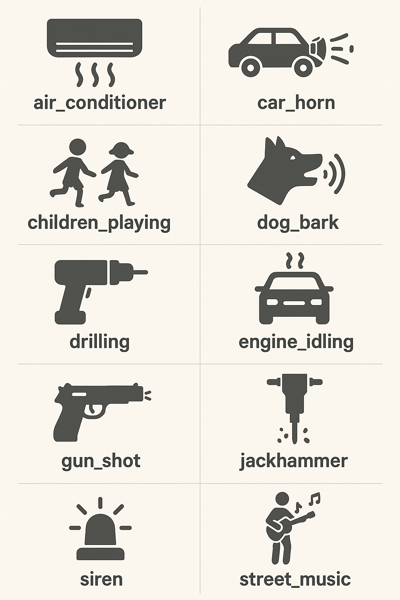
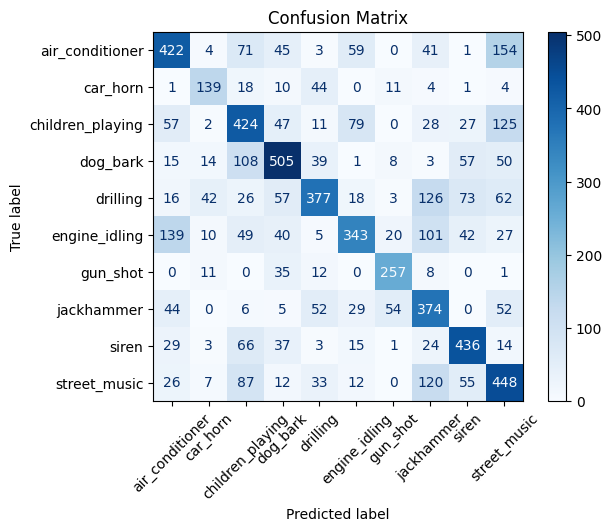
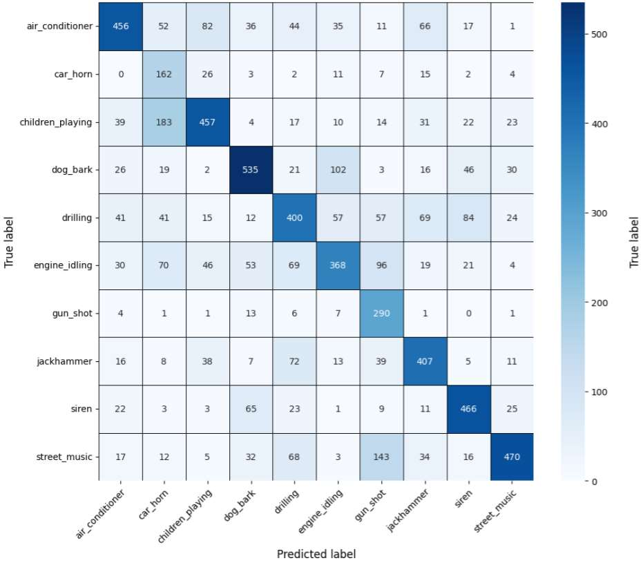
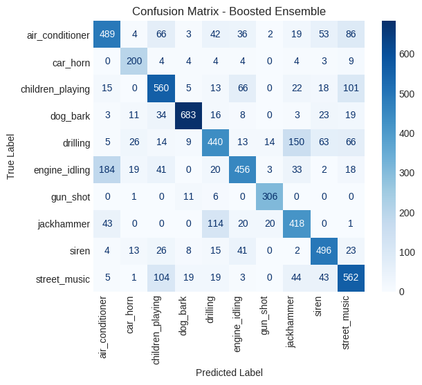

# Environmental Sound Classification

---

## 🧠 Problem Statement

Environmental sounds are critical cues for real-world applications like **surveillance**, **autonomous navigation**, and **assistive technologies**. This project aims to implement two deep learning models to classify environmental audio using the **UrbanSound8K** dataset:

- 🌀 A **Recurrent Neural Network (RNN)**-based model (LSTM, BiLSTM)
- 🧠 A **Transformer-based model** implemented `from scratch` without `nn.Transformer` or Hugging Face libraries

### Dataset Details
- [UrbanSound8K](https://urbansounddataset.weebly.com/urbansound8k.html)
- **8732 labeled audio clips**, each ≤ 4 seconds
- **10 sound classes**:  
  `air_conditioner`, `car_horn`, `children_playing`, `dog_bark`, `drilling`,  
  `engine_idling`, `gun_shot`, `jackhammer`, `siren`, `street_music`  
  

    

---

## 📊 Feature Engineering

### Data Preparation

* Combined all training folds into a single CSV with class and path.
* Visualized waveform and spectrogram of samples.

### Feature Extraction

* Extracted features:

  * Energy
  * Mel Spectrogram
  * MFCC
* Applied data augmentation and padding (with/without masking).

### Feature Configurations

1. **Basic**: Energy + mean Mel Spectrogram + mean MFCC (3 features)
2. **Full**: Energy + 40 Mel Bands + 13 MFCCs (54 features) — *main config*
3. **MFCC only**:

   * 13 MFCCs without masking
   * 13 MFCCs with masking

### Observations

* All configurations overfit on a basic GRU model.

---

## 🧠 Model Architectures (Keras)

### LSTM (Stacked)

* Two LSTM layers → Dense → Dropout → Softmax
* TimeDistributed layer projects inputs.

### Hybrid: LSTM + CNN

* CNN → MaxPooling → LSTMs → Dense Layers

### Bidirectional LSTM

* Two BiLSTM layers → Dense → Dropout → Softmax

### Bidirectional LSTM + CNN

* CNN → MaxPooling → BiLSTMs → Dense Layers

### Transformer

* Input Projection + Positional Encoding
* N encoder blocks with Multi-Head Attention + Feedforward
* Mean pooling → Classifier

---

## 🛠 Training Details

* Optimizer: Adam
* Loss: Categorical Crossentropy
* Callbacks: EarlyStopping, ModelCheckpoint, ReduceLROnPlateau
* Metrics: Accuracy, Macro F1-Score, Loss curves

---

## 🧪 Performance Summary

| Model Name                       | Accuracy  | F1 Score  |
| -------------------------------- | --------- | --------- |
| `lr_01 (LSTM)`                   | 0.574     | 0.581     |
| `default_bidirectional_lstm_cnn` | 0.600     | 0.618     |
| `Transformer (Adaboosted)`       | 0.7010    | 0.7184    |

### Confusion Matrix

1. **LSTM**  

  

2. **BiLSTMs + CNN**  

  

3. **Transformer**  

  

### ⚙️ Hyperparameter Tuning

- Explored:
  - LSTM units (32, 64, 128, 256)
  - Dropout rates (0.1–0.7)
  - Learning rates (0.0001–0.05)
  - Batch sizes (32–128)
  - Projection dimensions (4–128)
- Best results achieved with:
  - `default_bidirectional_lstm_cnn`
  - Transformer (Adaboosted top 10)

---

## 🔍 Error Analysis

* Most confusing class: `engine_idling`
* Often misclassified as: `air_conditioner`, `jackhammer`
* Highest error counts in:

  * `engine_idling`: 433
  * `drilling`: 423
  * `children_playing`: 376

## 💡 Additional Techniques

* RobustScaler with clipping to reduce outliers
* Adaboost ensemble over top 10 models based on accuracy

---

## 👥 Team Members

1. [**Mohamed Hassan**](https://github.com/mohassan5286)
2. [**Omar Hany**](https://github.com/OmarHani4306)
3. [**Mohamed Mohamed Ibrahim**](https://github.com/Mohamed-Mohamed-Ibrahim)

---